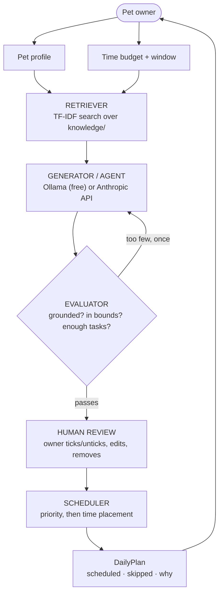

# 🐾 PawPal+ — an AI care planner for pet owners

**PawPal+** helps a busy pet owner build a daily care routine they can actually
follow. You enter a pet's species, breed, and age, plus how much time you
genuinely have today. The app looks up real care guidance for *that specific
pet*, drafts a set of tasks grounded in what it found, times them across your
day, and packs them into your schedule by priority — explaining every
decision along the way.

It matters because the easy version of this — "ask an LLM what to do with my
dog today" — is exactly the version that quietly makes things up. A pug and a
labrador should not get the same walk duration; a senior cat and a kitten
should not get the same grooming routine. PawPal+'s AI feature is
**Retrieval-Augmented Generation**: before the model writes anything, the app
retrieves the guidance relevant to *this* pet, hands the model only that text,
and requires every suggested task to cite where it came from. A task the model
can't tie back to a retrieved source is rejected before it ever reaches you.

---

## Original project (Modules 1–3): PawPal+

This project began as a Module 2 assignment — a Streamlit app for planning a
pet's daily care around an owner's available time, with **no AI involved**.
Its original scope was a plain Python domain model (`Owner`, `Pet`, `Task`,
`Scheduler`) that ranked tasks by priority, packed them into a time budget,
detected scheduling conflicts, and handled recurring daily/weekly tasks —
verified by 42 unit tests. This applied-AI-system project builds directly on
that unchanged foundation: the original scheduler still runs, untouched, and
everything below is a new layer built on top of it.

---

## Architecture overview

Data flows in one direction, with two places it can loop back to correct
itself, and three distinct places AI output gets checked before it reaches a
schedule:



- **Retriever** (`retriever.py`) — a hand-rolled TF-IDF search over 14
  markdown care-guidance files. Deterministic and offline: the same pet always
  retrieves the same sources on any machine.
- **Generator / Agent** (`pawpal_ai.py`) — builds a prompt from the retrieved
  sources plus the pet's profile and time window, then calls one of two
  interchangeable model backends (see below) for structured output.
- **Evaluator** — automated, every run. Rejects any task citing a source that
  wasn't retrieved, enforces duration/priority/duplicate bounds, and — if
  fewer than 3 tasks survive — sends **one** automatic follow-up request
  before giving up, so a weak first answer doesn't become a weak final answer.
- **Human review** — the owner ticks or unticks each AI suggestion, and can
  edit or 🗑️ remove *any* task, AI-suggested or manually added, at any time.
- **Scheduler** (`pawpal_system.py`) — 100% deterministic, no AI. Ranks
  accepted tasks by priority within the time budget, then places them by time
  of day within the owner's availability window.
- **Tester** — pytest, 141 tests, all offline, covering every stage above.

The full source diagram — including the observability and testing
subsystems, colour-coded by who/what is checking the AI's work — is at
[`diagrams/architecture.mmd`](diagrams/architecture.mmd). The original
Module 1–2 class design is at
[`diagrams/uml_final.mmd`](diagrams/uml_final.mmd).

---

## Setup instructions

Requires Python 3.10+. Pick **one** of two model backends — both use
identical retrieval, guardrails, and scheduling; only the model call differs.

```bash
# 1. Create and activate a virtual environment
python3 -m venv .venv
source .venv/bin/activate          # Windows: .venv\Scripts\activate

# 2. Install dependencies
pip install -r requirements.txt

# 3. Set up a backend — Option A or B below

# 4. Run it
python -m streamlit run app.py
```

Use `python -m streamlit run app.py`, not a bare `streamlit run app.py` — on
a machine with Anaconda or another Python installed, a bare `streamlit` can
silently resolve to *that* interpreter and fail with `ModuleNotFoundError`.
`python -m` guarantees you're using the environment you just activated.

### Option A — free, local, no account

Runs a small open model on your own machine via [Ollama](https://ollama.com).
No API key, no billing, works offline once the model is downloaded.

```bash
brew install ollama         # macOS; see ollama.com/download for other OSes
brew services start ollama  # runs Ollama in the background
ollama pull llama3.2:3b     # one-time download, ~2GB

cp .env.example .env        # already defaults to PAWPAL_PROVIDER=ollama
```

Needs ~4GB free RAM. Each suggestion takes 20–50 seconds — slower than a
cloud API because it's your own hardware doing the work.

### Option B — Anthropic API (paid, faster)

```bash
cp .env.example .env
```

Edit `.env`, switch the two `PAWPAL_*` lines, and add a real key from
<https://console.anthropic.com/settings/keys>:

```
PAWPAL_PROVIDER=anthropic
PAWPAL_MODEL=claude-opus-5
ANTHROPIC_API_KEY=sk-ant-your-real-key-here
```

A Claude.ai subscription does **not** include API access — it's billed
separately, pay-as-you-go. One suggestion costs roughly a cent.
`.env` is gitignored either way — never commit it.

### Run the tests

```bash
python -m pytest
```

141 tests, all offline and free — no API key, no running Ollama server, and
no network call required.

### Run the CLI demo (no AI backend needed at all)

```bash
python main.py
```

Exercises the original Module 2 scheduler — conflict detection, sorting,
filtering, recurring tasks — with no AI involved.

---

## Sample interactions

Three real runs from this project's development, verbatim from the app
(times below are placements chosen by the Scheduler; sources are what the
Generator actually cited). Model: `llama3.2:3b` via Ollama, the free backend.

### 1. A labrador, no special constraints

**Input:** species `dog`, breed `labrador`, age `4`, budget `120 min`, window
`07:00`–`20:00`.

**Output** (8 tasks, all grounded):

| Time | Task | Min | Priority | Source |
|---|---|---|---|---|
| 08:15 | Morning walk | 30 | high | `dog-walking` |
| 08:15 | Morning meal | 10 | high | `dog-feeding` |
| — | Potty break ×3 | 5 each | medium | `dog-walking` |
| 14:45 | Afternoon meal | 10 | high | `dog-feeding` |
| 18:00 | Evening walk | 30 | high | `dog-walking` |

Sample rationale, taken directly from the model's output for the first task:
*"Most healthy adult dogs need 30 to 60 minutes of walking per day, usually
split across two outings so the dog is not holding its bladder for long
stretches."* — a paraphrase of `knowledge/dog-walking.md`, not the model's own
claim.

### 2. A pug — the retrieval genuinely changes the plan

**Input:** species `dog`, breed `pug`, age `3`, same budget and window.

**Output** (4 tasks):

| Time | Task | Min | Priority | Source |
|---|---|---|---|---|
| 08:20 | Morning walk | **15** | high | `dog-walking` |
| 08:20 | Morning meal | 10 | high | `dog-feeding` |
| — | Potty break | 5 | medium | `dog-walking` |
| — | Medication (if applicable) | — | — | — |

The word "pug" pulled `knowledge/flat-faced-breeds.md` into the retrieved
sources — a chunk explaining that flat-faced breeds can't cool themselves
efficiently and shouldn't be walked longer than ~15–20 minutes. The labrador
above got a 30-minute walk from the *identical* code path; the pug didn't,
because different sources were retrieved for it. That's the RAG feature doing
real work, not decoration.

### 3. A senior cat — species and age both change the routine

**Input:** species `cat`, breed `persian`, age `12`, budget `100 min`, window
`07:00`–`21:00`.

**Output** (8 tasks): morning potty break, morning meal, water refresh, and
brushing all at 08:20; a litter box scoop with no fixed time; an afternoon
potty break at 15:20; evening meal and water refresh at 18:50. No walk was
proposed — cats aren't walked, and the age (12) pulled in
`knowledge/senior-pets.md` alongside `cat-litter.md`, `cat-grooming.md`, and
`cat-feeding.md`, none of which mention walking.

---

## Design decisions

**TF-IDF over embeddings for retrieval.** A vector database would scale
better to a large corpus, but for 14 hand-written files it adds a dependency,
a network call, and non-determinism for no real benefit. Plain TF-IDF is
free, offline, and — crucially — deterministic, which makes retrieval itself
unit-testable: the same query returns the same sources every time, on any
machine, with no external service in the loop.

**Two swappable model backends, not one.** A portfolio project that requires
a paid API key is a project most reviewers won't actually run. Supporting a
free local model (Ollama) alongside the paid Anthropic API means anyone can
clone this and see it work end-to-end for $0. The trade-off is real: the free
model is slower (20–50s vs a few seconds) and needed extra engineering (see
Testing Summary) to reliably produce full-day plans. I judged that trade-off
worth it — an AI feature nobody can run isn't demonstrating anything.

**A hard validation boundary between model text and domain objects.**
`_validate()` in `pawpal_ai.py` is the only path from "text the model wrote"
to "a `Task` object that can enter someone's schedule." Every task must cite
a source that was actually retrieved, every duration is bounds-checked, every
duplicate is dropped. The alternative — trusting model output directly —
would fail unacceptably for a system whose recommendations touch things like
exercise duration for an old or flat-faced animal. Engineering cost: a
schema, a grounding check, and a fallback for models that skip fields. I
judged that cost non-negotiable for this domain.

**A one-shot self-correction retry, not an open-ended agent loop.** When a
model under-delivers (see the "one task" bug below), the fix could have been
an agentic loop that keeps retrying until satisfied. I capped it at exactly
one follow-up call instead: it fixes the observed failure mode, keeps
worst-case latency bounded (important on a 20–50s-per-call local model), and
avoids the complexity of deciding when to stop. If two calls aren't enough,
the honest answer is a better prompt, not a third call.

**The Scheduler stays 100% free of AI.** The model only ever proposes
candidate tasks; a plain deterministic algorithm decides what fits the budget
and when it happens. This was a conscious choice to keep the safety-critical
logic (does this fit? does this respect the owner's window?) exhaustively
unit-testable and fully reproducible, rather than asking the model to place
tasks on a timeline and hoping it respects the budget.

**Rejections are shown, not hidden.** When the evaluator drops a task, the UI
shows it with a 🛡️ marker and the exact reason. A quieter UI would look more
polished; showing the rejection is what lets a user (or a grader) verify the
guardrail is actually doing something, rather than taking it on faith.

---

## Testing summary

**141 tests, all offline** — 42 for the original Module 2 scheduler, 99 for
the AI layer added in this project. The AI tests use a fake API client (and,
for Ollama, a mocked HTTP layer), so the full suite runs with no API key, no
running model server, and no network call.

**What worked well:** the deterministic retriever and the two-phase scheduler
were both straightforward to test exhaustively — edge cases like a
zero-minute budget, a reversed availability window, and two tasks with the
same preferred time all have explicit tests and explicit behavior. The
grounding check (reject any task citing a source that wasn't retrieved) has
not produced a single false negative across dozens of live runs against both
backends.

**What didn't work at first, and what I learned fixing it:**

- **Cross-species contamination.** An early retrieval scorer de-duplicated
  repeated query terms, so a cat's query could retrieve dog grooming advice.
  Caught by a live smoke test before any user saw it, not by a unit test —
  I hadn't yet written a test asserting species isolation. Fixed by making
  species terms count multiple times toward the TF-IDF score, then added the
  test.
- **The free model sometimes proposed just one task.** Discovered from actual
  usage logs, not synthetic testing — `pawpal.log` showed
  `1 proposed -> 1 accepted` for real runs. The guardrails were working
  correctly every time; the *model* was under-delivering. Fixed with a
  stronger prompt plus a one-shot self-correction retry (see Design
  Decisions), and verified with a mutation test: temporarily disabling the
  fix and confirming 5 of the new tests correctly fail, proving the tests
  would actually catch this regression coming back, not just pass by luck.
- **Retrying at `temperature: 0` does nothing by itself.** The local backend
  runs at temperature 0 for reproducibility. My first instinct — "just call
  it again" — would have returned the identical short answer every time,
  since a deterministic model given an identical prompt makes an identical
  choice. The retry only works because the follow-up prompt is genuinely
  different (it lists what was already proposed and asks for more).

**What I learned:** a small local model needs guidance spelled out as hard
requirements that a larger hosted model would follow from a soft instruction
— "propose a full day's routine" needed to become "propose at least 4 tasks,
covering these specific categories." I also learned that testing an
LLM-backed feature needs *both* deterministic unit tests (fast, free, catch
logic bugs immediately) *and* live runs against the real model (catch
prompt-following failures no mock can surface) — neither alone would have
found the one-task bug.

---

## Reflection

Building this made the actual engineering problem in an "AI feature" clearer
to me: it's rarely the model call itself, and mostly the layer around it —
the retrieval design that keeps the model honest, the validation boundary
that decides what's allowed to reach a user, and the tests that let you trust
a system whose core component is non-deterministic. I also came away with a
general engineering habit I didn't have going in: design for graceful
degradation everywhere it's cheap to do so — a failed follow-up call
degrades to a partial result instead of an error, an unset time window
degrades to the original scheduler behavior, a malformed time is cleared
instead of discarding an otherwise-good task. None of that is AI-specific;
it's just good systems thinking that AI features make you practice more
often, because the thing you're wrapping is inherently less predictable than
a normal function call.

*The graded responsible-AI reflection — limitations and biases, potential for
misuse, what surprised me about reliability, and a specific example of AI
collaboration during this project (one helpful suggestion, one flawed one) —
is documented separately in [`model_card.md`](model_card.md).*
